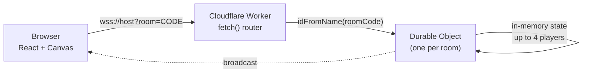

<div align="center">

# 2D Multiplayer Arena Shooter

A real-time top-down multiplayer shooter with a React/Canvas client and a
Cloudflare Workers (Durable Objects) backend. Up to 4 players per match,
fighting under real-time fog of war, in matches that scale horizontally
instead of sharing a single server.

[](https://react.dev)
[](https://www.typescriptlang.org)
[](https://developers.cloudflare.com/durable-objects/)
[](https://developer.mozilla.org/en-US/docs/Web/API/WebSockets_API)
[](#license)

[Live Demo](#) · [Report a Bug](#) · [Request a Feature](#)

</div>

<!-- Swap in an actual screenshot or gameplay GIF here — this is the single -->
<!-- highest-impact thing you can add to this README. -->
<!--  -->

---

## Table of Contents

- [Features](#features)
- [Tech Stack](#tech-stack)
- [Architecture](#architecture)
- [Getting Started](#getting-started)
- [Controls](#controls)
- [Deployment](#deployment)
- [Known Limitations & Roadmap](#known-limitations--roadmap)
- [Project Structure](#project-structure)
- [License](#license)

## Features

- 🎮 **Real-time multiplayer** over raw WebSockets — movement, shooting,
  health, and respawns all sync live between players.
- 🧩 **Per-match isolation** — every room runs in its own Cloudflare Durable
  Object instance, so one room's traffic or a crash never touches another
  room. Rooms scale horizontally instead of funnelling through one shared
  server.
- 💀 **Death & respawn loop** — players spawn in fixed corners of the map,
  hit a death screen on elimination, and can respawn at their own corner or
  leave the match.
- 🌫️ **Fog of war / line of sight** — a custom 2D raycasting engine computes
  a 360° visibility polygon around each player against the map's wall
  geometry. Opponents outside your line of sight aren't rendered at all, not
  just dimmed.
- 📊 **Live scoreboard & kill feed** — kills, deaths, alive/dead status, and
  ping for every connected player, plus a fading kill feed for recent
  eliminations.
- 🔊 **Directional audio** — opponent footsteps are stereo-panned and
  distance-attenuated with the Web Audio API, so you can hear roughly where
  someone is relative to you.
- 🧈 **Smooth network interpolation** — remote player movement uses
  frame-rate-independent exponential interpolation, so it looks fluid
  regardless of your monitor's refresh rate or the server's tick rate.
- 🔫 **Three weapons** — handgun, shotgun, and machine gun, each with
  distinct fire rate, damage, spread, and bullet speed.
- 💾 **Persisted settings** — volume and audio toggles are saved to
  `localStorage` and restored on reload.

## Tech Stack

| Layer      | Tech                                                     |
| ---------- | --------------------------------------------------------- |
| Client     | React 19, TypeScript, Vite, Tailwind CSS, HTML5 Canvas     |
| Realtime   | Raw WebSockets                                             |
| Server     | Cloudflare Workers, Durable Objects                        |
| Deployment | Wrangler (server), Vite/TanStack Start (client)            |

## Architecture



Each room gets its own Durable Object, addressed by the room code
(`idFromName(roomCode)`). This is the key scalability property: a bug,
crash, or spike of traffic in one room's DO has zero effect on any other
room — rooms scale independently instead of all funnelling through a single
shared server instance.

Within a room, the server is authoritative for **health, kills/deaths, and
respawn positions** — a client can't fake surviving a hit. Movement and hit
reports are currently client-reported and trusted; see
[Known Limitations](#known-limitations--roadmap) below.

## Getting Started

### Prerequisites

- Node.js 18+
- npm

### 1. Clone and install

```bash
git clone <your-repo-url>
cd canvas
cd server && npm install
cd ../client && npm install
```

### 2. Configure the client

The client needs to know where to reach the WebSocket server. Create/edit
`client/.env`:

```env
VITE_WS_URL=ws://127.0.0.1:8787
```

> [!NOTE]
> Use `wss://your-worker-subdomain.workers.dev` once deployed.

### 3. Run the server (Cloudflare Worker via Wrangler)

```bash
cd server
npm run dev
```

This starts a local Wrangler dev server on `http://127.0.0.1:8787`.

> [!WARNING]
> Run this from inside `server/`, not the repo root — that's where
> `wrangler.jsonc` lives. Running `wrangler dev` from the repo root will
> fail with a "Missing entry-point" error.

### 4. Run the client

In a separate terminal:

```bash
cd client
npm run dev
```

Open the printed local URL (defaults to `http://localhost:3000`).

### 5. Play

Open the client in two or more browser tabs to test multiplayer locally —
create a room in one tab, then join it with the room code from another.

## Controls

| Input       | Action                             |
| ----------- | ----------------------------------- |
| `W A S D`   | Move                                 |
| Mouse       | Aim                                  |
| Left Click  | Fire (hold for automatic weapons)    |
| `1` `2` `3` | Switch weapon                        |

## Deployment

- **Server:** `cd server && npx wrangler deploy`
- **Client:** `cd client && npm run build`, then deploy the output with your
  static host of choice (Cloudflare Pages, Vercel, Netlify, etc.). Point
  `VITE_WS_URL` at your deployed Worker's `wss://` URL before building.

## Known Limitations & Roadmap

> [!WARNING]
> Movement and hit detection are client-reported, not server-validated. The
> server trusts the position and hit messages a client sends — a malicious
> client could theoretically move faster than allowed or claim hits it
> shouldn't. Server-side speed/range validation is the natural next step.

> [!NOTE]
> Fog of war is computed client-side. A modified client could ignore it and
> render through walls, since the server doesn't filter position data based
> on visibility. True server-authoritative visibility (only sending updates
> for players actually in view) would close this gap.

- No automated tests yet, despite Vitest being wired into the client's
  toolchain.
- No CI/CD pipeline — deploys are manual via Wrangler/Vite.

## Project Structure

<details>
<summary>Click to expand</summary>

```
canvas/
├── client/
│   ├── public/js/            # Canvas game engine (rendering, physics, networking)
│   │   ├── classes/           # Player, Bullet, GunManager, Sprite
│   │   ├── systems/           # Collision, Camera, Render
│   │   ├── network/           # WebSocket client / message handling
│   │   └── utils/             # Raycasting, audio, collision helpers
│   └── src/                   # React shell: menu, HUD, scoreboard, settings
│       ├── components/
│       └── hooks/
└── server/
    └── index.ts                # Cloudflare Worker + Durable Object (game server)
```

</details>

## License

This project is licensed under the MIT License — see the
[LICENSE](./LICENSE) file for details.

<div align="center">

If you found this interesting, consider giving it a ⭐

</div>
